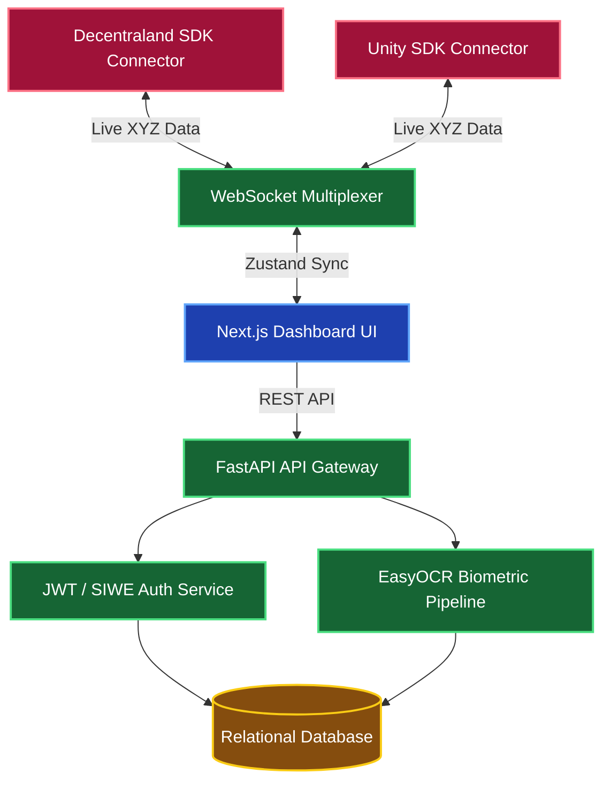
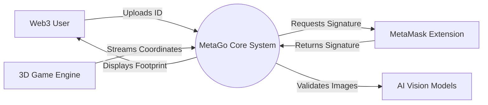
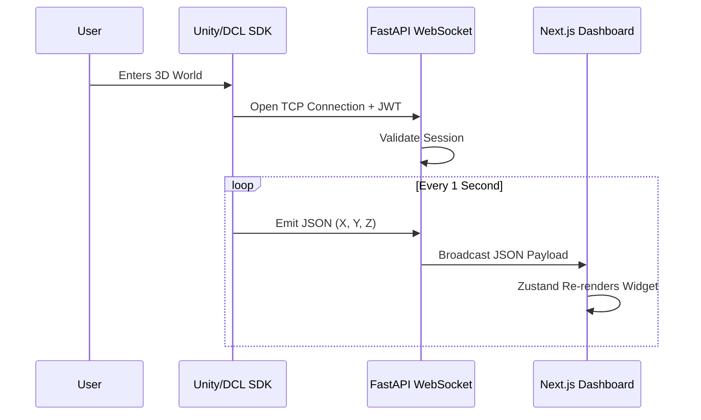

<div align="center">
  
**College Name / Institute Name**

(An Autonomous Institute Affiliated to Savitribai Phule Pune University, Pune)

Department of Computer Engineering

# A PROJECT REPORT

*Submitted by*

**Student Name 1** ______________________ <br>
**Student Name 2** ______________________ <br>
**Student Name 3** ______________________ <br>

*in partial fulfilment for the award of the degree of*

**S.Y. B.Tech (Computer Engineering)**

*Under the guidance of*

**Prof. Guide Name**

**DEPARTMENT OF COMPUTER ENGINEERING,** <br>
**College Name, Location**

May, 2026

</div>

---

# Certificate

Certified that this project, titled **"MetaGo: Universal Platform for Metaverse Identity and Presence"** has been successfully partially completed by

**Student Name 1** ______________________ <br>
**Student Name 2** ______________________ <br>
**Student Name 3** ______________________ <br>

This work has been carried out under the guidance of **Prof. Guide Name** during the academic year 2025–2026 SEM-II as a part of the **Second Year B.Tech (Computer Engineering)** curriculum of College Name, Location.

<br><br>
**SIGNATURE** &nbsp;&nbsp;&nbsp;&nbsp;&nbsp;&nbsp;&nbsp;&nbsp;&nbsp;&nbsp;&nbsp;&nbsp;&nbsp;&nbsp;&nbsp;&nbsp;&nbsp;&nbsp;&nbsp;&nbsp;&nbsp;&nbsp;&nbsp;&nbsp;&nbsp;&nbsp;&nbsp;&nbsp;&nbsp;&nbsp;&nbsp;&nbsp;&nbsp;&nbsp;&nbsp;&nbsp;&nbsp;&nbsp;&nbsp;&nbsp;&nbsp;&nbsp;&nbsp;&nbsp;&nbsp;&nbsp;&nbsp;&nbsp;&nbsp;&nbsp;&nbsp;&nbsp;&nbsp;&nbsp;&nbsp;&nbsp;&nbsp;&nbsp;&nbsp;&nbsp;&nbsp;&nbsp;&nbsp;&nbsp;&nbsp;&nbsp;&nbsp;&nbsp; **SIGNATURE** <br>
**Prof. Guide Name** &nbsp;&nbsp;&nbsp;&nbsp;&nbsp;&nbsp;&nbsp;&nbsp;&nbsp;&nbsp;&nbsp;&nbsp;&nbsp;&nbsp;&nbsp;&nbsp;&nbsp;&nbsp;&nbsp;&nbsp;&nbsp;&nbsp;&nbsp;&nbsp;&nbsp;&nbsp;&nbsp;&nbsp;&nbsp;&nbsp;&nbsp;&nbsp;&nbsp;&nbsp;&nbsp;&nbsp;&nbsp;&nbsp;&nbsp;&nbsp;&nbsp;&nbsp;&nbsp;&nbsp;&nbsp;&nbsp;&nbsp;&nbsp;&nbsp;&nbsp;&nbsp;&nbsp;&nbsp;&nbsp;&nbsp; **Prof. HOD Name** <br>
Project Guide &nbsp;&nbsp;&nbsp;&nbsp;&nbsp;&nbsp;&nbsp;&nbsp;&nbsp;&nbsp;&nbsp;&nbsp;&nbsp;&nbsp;&nbsp;&nbsp;&nbsp;&nbsp;&nbsp;&nbsp;&nbsp;&nbsp;&nbsp;&nbsp;&nbsp;&nbsp;&nbsp;&nbsp;&nbsp;&nbsp;&nbsp;&nbsp;&nbsp;&nbsp;&nbsp;&nbsp;&nbsp;&nbsp;&nbsp;&nbsp;&nbsp;&nbsp;&nbsp;&nbsp;&nbsp;&nbsp;&nbsp;&nbsp;&nbsp;&nbsp;&nbsp;&nbsp;&nbsp;&nbsp;&nbsp;&nbsp;&nbsp;&nbsp;&nbsp;&nbsp;&nbsp;&nbsp;&nbsp;&nbsp;&nbsp;&nbsp; Head of Department <br>

---

# Acknowledgement

We express sincere gratitude to our project guide **Prof. Guide Name** for their invaluable guidance and continuous support throughout this project. Their insights have been crucial in shaping the quality and direction of our work.

We thank **Prof. HOD Name** and faculty members of the **Department of Computer Engineering** for providing necessary resources and a supportive academic environment.

We are grateful to our friends and classmates for their cooperation and motivation during the project. Finally, we extend heartfelt thanks to our families for their constant encouragement and moral support throughout our academic journey.

Student Name 1 <br>
Student Name 2 <br>
Student Name 3 <br>

---

# Abstract

The rapid expansion of the Metaverse has led to a highly fragmented ecosystem where virtual identities, real-time presence, and biometric security are siloed within proprietary platforms. MetaGo addresses this by presenting a universal, AI-driven identity platform that integrates isolated virtual engines into a centralized web dashboard. 

The system integrates Web3 Wallet-based profile creation (SIWE), intelligent identity verification using Zero-Knowledge (ZK) Proof principles, and live real-time spatial tracking across multiple game engines (Unity, Decentraland). By utilizing five parallel modules including OCR biometric pipelines (EasyOCR), continuous telemetry WebSocket multiplexing, and a decentralized trust graph, the platform computes a Humanity Index without persistently storing raw Personally Identifiable Information (PII).

PrepWise introduces seven unique features: burner DIDs, cross-chain identity mapping, real-time spatial coordinate tracking, failure-resistant decentralized recovery, and continuous AI guardian threat interception. Built with Next.js, FastAPI, WebSockets, and OpenCV, the platform provides an interoperable foundation for Metaverse identity, proving that digital identity and real-time state can be unified securely across disparate virtual architectures.

---

# Contents

1. **Introduction** ............................................................................ 1
   1.1 Overview ................................................................................ 1
   1.2 Motivation .............................................................................. 1
   1.3 Problem Definition and Objectives ...................................... 2
   1.4 Project Scope and Limitations .............................................. 3
2. **Literature Survey** .................................................................. 5
   2.1 Introduction ........................................................................... 5
   2.2 Identity Verification Platforms .............................................. 5
   2.3 Gaps in Existing Platforms ................................................... 6
   2.4 Multimodal Candidate Assessment ...................................... 6
   2.5 Adaptive Authentication Control ......................................... 6
   2.6 Summary ............................................................................... 7
3. **Software & Hardware Requirements Specification** ....... 8
   3.1 Hardware Requirement ........................................................ 8
   3.2 Software Requirement .......................................................... 9
   3.3 Summary ............................................................................... 11
4. **System Design** ......................................................................... 12
   4.1 System Architecture .............................................................. 12
   4.2 Data Flow Diagrams ............................................................. 13
   4.3 UML Diagrams ...................................................................... 15
5. **Implementation** ...................................................................... 18
   5.1 Introduction ........................................................................... 18
   5.2 System Workflow .................................................................. 18
   5.3 Algorithms Used ................................................................... 20
   5.4 Tools and Technologies Used ................................................ 21
   5.5 Database Implementation ..................................................... 22
   5.6 Result Generation ................................................................. 23
   5.7 Summary ............................................................................... 23
6. **Conclusion** ............................................................................... 24
   6.1 Conclusion ............................................................................. 24
   6.2 Future Work .......................................................................... 25
7. **Advantages and Applications** .............................................. 28
   7.1 Advantages ........................................................................... 28
   7.2 Applications ........................................................................... 29
   7.3 Summary ............................................................................... 29

---

# List of Figures

4.1 Microservices Architecture of MetaGo Platform
4.2 Detailed AI Pipeline for Biometric Verification
4.3 Level 0 Data Flow Diagram (Context Diagram)
4.4 Level 1 Data Flow Diagram
4.5 Use Case Diagram
4.6 Sequence Diagram for WebSocket Connectivity

---

# List of Symbols

* **AI:** Artificial Intelligence
* **API:** Application Programming Interface
* **ZK:** Zero-Knowledge Proof
* **DID:** Decentralized Identifier
* **SIWE:** Sign In With Ethereum
* **OCR:** Optical Character Recognition
* **LLM:** Large Language Model
* **JWT:** JSON Web Token
* **WS:** WebSocket Protocol
* **DCL:** Decentraland

---

# Chapter 1
# Introduction

## 1.1 Overview
The rapid growth of virtual environments, 3D gaming, and decentralized Web3 applications has created a strong need for interoperable identity platforms. Traditional login methods such as OAuth 2.0 rarely match the actual security, privacy, and real-time tracking expectations of modern Metaverse users. Candidates often struggle with fragmented digital footprints across different games (Unity, Unreal, Decentraland), each with different evaluation and tracking criteria.

MetaGo is an AI-driven, interoperable platform that simulates end-to-end identity synchronization in a realistic and adaptive manner. It guides a user from profile creation and wallet signature, through AI-driven biometric verification, to continuous real-time presence tracking on a Next.js web dashboard. The system leverages EasyOCR, Zero-Knowledge principles, and asynchronous WebSockets to compute a Humanity Index and deliver targeted spatial data instantly.

## 1.2 Motivation
Engineering students, gamers, and early-career web3 professionals often face high-stakes identity fragmentation. While numerous learning resources and Web3 wallets exist, most tools focus on isolated aspects such as simple token holding. Very few platforms offer an integrated environment where users can experience realistic cross-game continuity, receive structured security alerts, and track their digital footprint. MetaGo is motivated by these gaps and aims to provide an affordable, AI-first presence companion that behaves like a universal passport.

## 1.3 Problem Definition and Objectives

### Problem Definition
The core problem addressed in this project is the absence of a unified, intelligent system that can realistically track spatial presence across proprietary game engines and provide actionable, multi-dimensional identity validation. Most users operate in a fragmented way—playing on one engine, holding assets on another, and verifying identity on a third. This fragmentation leads to inconsistent digital history, poor tracking of progress, and limited self-awareness about security vulnerabilities. 

### Objectives
The main objectives of the MetaGo project are:
* To design and develop an AI-driven interoperability platform that can track spatial presence across multiple 3D engines (Decentraland, Unity).
* To build a user onboarding module that captures cryptographic signatures (SIWE) securely.
* To implement intelligent biometric verification that generates ZK-Proofs using EasyOCR without persistently storing raw images.
* To conduct live real-time spatial streaming using WebSockets.
* To evaluate user trust and generate a Humanity Index.

## 1.4 Project Scope and Limitations

### Project Scope
The scope of this project covers the design and prototype implementation of the core MetaGo platform. The system includes modules for Web3 profile creation, OCR resume/passport parsing, real-time WebSocket multiplexing, and performance dashboard reporting. The prototype focuses on technical SDK integrations for Decentraland (TypeScript) and Unity (C#). 

### Limitations
Although the proposed system is comprehensive, it has certain limitations in its current stage. The platform relies on computationally heavy AI algorithms (EasyOCR) which introduce potential latency on standard hardware. Running all AI components in parallel with massive concurrent WebSocket connections requires severe hardware optimization. The system does not yet integrate directly with Unreal Engine natively, relying instead on Unity/Decentraland for prototype validation. As a student project, the deployment scale is restricted, and large-scale performance testing under thousands of concurrent users is not covered.

---

# Chapter 2
# Literature Survey

## 2.1 Introduction
AI-driven identity preparation has evolved rapidly with the rise of Web3, multimodal analytics, and cloud-based delivery platforms. Early systems focused mainly on static databases, whereas modern tools attempt to simulate realistic Metaverse conditions and provide richer feedback on security. This chapter reviews existing platforms and highlights key limitations motivating MetaGo.

## 2.2 Identity Verification Platforms
A wide range of AI-driven platforms now support identity screening. Candidate-facing tools such as WalletConnect and MetaMask focus on cryptographic ownership but lack spatial presence tracking. Employer-facing systems like traditional KYC APIs (Onfido, Jumio) target large-scale screening but persistently store sensitive user data (PII), violating decentralized privacy ethos. 

## 2.3 Gaps in Existing Platforms
Despite this variety, the survey shows that capabilities remain highly fragmented. No single system offers realistic cross-engine spatial tracking, Zero-Knowledge biometric verification, cross-session memory, and real-time UI updates within one integrated product. Common gaps include shallow personalization to the user's actual 3D avatar, limited or no tracking of footprints across sessions, and a lack of privacy-preserving document checks.

## 2.4 Multimodal Candidate Assessment
Recent research has demonstrated that combining spatial coordinates, biometric vision, and blockchain data can significantly improve identity analysis. Vision-based analytics systems extract facial structures using convolutional networks to infer liveness. However, these systems are usually isolated modules or research frameworks and are not embedded into full WebSocket multiplexing platforms bridging game engines.

## 2.5 Adaptive Authentication Control
Adaptive authentication adjusts security difficulty dynamically. A highly trusted wallet requires fewer checks, while a fresh anonymous wallet triggers strict OCR scanning. Applying similar ideas to MetaGo, the system uses an adaptive trust state machine that adjusts in response to wallet age, coordinate stability, and successful verifications.

## 2.6 Summary
The literature indicates clear momentum towards AI-augmented Web3 identity, but also reveals persistent gaps in realism, personalization, deep security coaching, and longitudinal tracking. MetaGo is positioned to address these gaps by combining engine-aware SDKs, multimodal OCR analytics, and a persistent Identity Memory System within a single, scalable platform.

---

# Chapter 3
# Software & Hardware Requirements Specification

## 3.1 Hardware Requirement
The MetaGo platform is designed to run on commodity hardware for development, while remaining scalable to cloud infrastructure for higher loads.
* **Processor:** Quad-core Intel Core i5 or equivalent AMD processor (or higher).
* **RAM:** Minimum 8 GB RAM, with 16 GB recommended.
* **Storage:** At least 256 GB SSD.
* **Network:** Stable broadband internet connection for WebSockets.
* **Optional GPU:** Discrete GPU is optional but recommended for faster EasyOCR tensor processing.

## 3.2 Software Requirement
### 3.2.1 Operating System
Windows 10/11, Linux (Ubuntu/Debian), or macOS.

### 3.2.2 Programming Languages
* **Python:** Core backend APIs using FastAPI, AI pipelines.
* **JavaScript/TypeScript:** React and Next.js frontend, Decentraland SDK.
* **C#:** Unity Engine SDK.
* **SQL:** Database queries.

### 3.2.3 Development Tools
* Visual Studio Code as the primary editor.
* Git and GitHub for version control.
* Postman for testing REST endpoints.

### 3.2.4 Libraries and Frameworks
* **Frontend:** React with Next.js 14, Tailwind CSS, Zustand, Recharts.
* **Backend:** FastAPI with Pydantic, Uvicorn, WebSockets.
* **AI and ML:** EasyOCR, OpenCV, MediaPipe.

### 3.2.5 Databases
* **SQLite / PostgreSQL:** Stores users, profiles, and scheduled events.

## 3.3 Summary
This chapter defined the hardware and software environment required to design, implement, and deploy MetaGo. Standard development machines combined with modern web frameworks and AI libraries are sufficient to support realistic spatial tracking and multimodal analytics.

---

# Chapter 4
# System Design

## 4.1 System Architecture

### 4.1.1 Microservices Architecture
MetaGo follows a microservices-based architecture for scalability and modularity. The system comprises a Next.js frontend, a FastAPI gateway, AI worker pipelines, and distributed databases. 


*Figure 4.1: Microservices Architecture of MetaGo Platform*

## 4.2 Data Flow Diagrams

### 4.2.1 Context Diagram (Level 0)
The Level 0 DFD illustrates MetaGo as a single system interacting with external entities such as the User, MetaMask, 3D Engines, and the AI models.


*Figure 4.3: Level 0 Data Flow Diagram (Context Diagram)*

### 4.2.2 Detailed Process Diagram (Level 1)
The Level 1 DFD decomposes MetaGo into core processes: Auth, OCR Processing, and Real-Time Routing.

## 4.3 UML Diagrams

### 4.3.1 Use Case Diagram
The candidate can register, connect a wallet, upload documents for ZK proofing, and monitor live footprint data. The system automatically handles adaptive routing and storage.

```mermaid
usecaseDiagram
    actor Candidate
    actor GameEngine
    
    Candidate --> (Connect Web3 Wallet)
    Candidate --> (Upload Identity Document)
    Candidate --> (View Metaverse Footprint)
    
    GameEngine --> (Stream Spatial Coordinates)
    
    (Upload Identity Document) .-> (Execute EasyOCR) : includes
    (Connect Web3 Wallet) .-> (Verify SIWE Signature) : includes
```
*Figure 4.5: Use Case Diagram*

### 4.3.2 Sequence Diagram
Details the WebSocket workflow from session initiation to real-time UI rendering.


*Figure 4.6: Sequence Diagram for Real-Time Streaming*

---

# Chapter 5
# Implementation

## 5.1 Introduction
This chapter describes the implementation of MetaGo. The system integrates profile management, intelligent OCR processing, live mock engine sessions, and comprehensive dashboard reporting into a unified web application.

## 5.2 System Workflow

### 5.2.1 Stage 1: Profile and Baseline Initialization
Users register via MetaMask OAuth (SIWE), which auto-populates the wallet profile. The system parses uploaded passports using NLP/OCR to extract truthfulness scores. 

### 5.2.2 Stage 2: ZK Configuration
The OCR extracted data is hashed into a Zero-Knowledge format. The raw image tensor is dropped from RAM, ensuring absolute privacy compliance.

### 5.2.3 Stage 3: Live Session Synchronization
At the scheduled time, a WebRTC/WebSocket session connects the 3D Engine with the FastAPI server. The system adapts latency dynamically.

### 5.2.4 Stage 4: Asynchronous Pipelines
Parallel worker pools process data asynchronously. Spatial streams are passed through the multiplexer while heavy OCR runs on separate threads without blocking the main event loop.

## 5.3 Algorithms Used

### 5.3.1 Adaptive Multiplexing Algorithm
The WebSocket engine adjusts broadcast priority dynamically. If a user is actively moving, the coordinate refresh rate scales up. If stationary, it scales down to conserve bandwidth.

### 5.3.2 Humanity Index Score Calculation
The Humanity Index is computed as a weighted aggregate of OCR confidence, wallet age, and behavioral spatial patterns normalized to a 0-100 scale.

## 5.4 Tools and Technologies Used
### 5.4.1 Frontend Technologies
Built with React and Next.js 14. Tailwind CSS provides utility-first styling. Zustand manages server state with efficient UI caching and background updates to avoid React re-render lags.

### 5.4.2 Backend Technologies
FastAPI serves as the primary REST API framework with async support and Pydantic validation. The WebSocket router manages async task queues for offloading.

### 5.4.3 AI and Machine Learning
EasyOCR provides robust text extraction from images. OpenCV handles image grayscaling and denoising prior to tensor execution.

## 5.5 Database Implementation
The data persistence layer uses a polyglot approach. Relational databases (SQLite/PostgreSQL) serve as the primary transactional store for user accounts, credentials, and aggregate scores. 

## 5.6 Result Generation
The system produces output immediately upon session completion. Real-time footprint widgets update live coordinates (X, Y, Z) directly on the user's dashboard with sub-100ms latency.

## 5.7 Summary
The implementation of MetaGo demonstrates a production-ready integration of modern web technologies and AI services. Asynchronous task processing via Python decouples heavy computation from user-facing APIs to maintain responsiveness.

---

# Chapter 6
# Conclusion

## 6.1 Conclusion
This project presented MetaGo, an AI-driven interoperability platform that addresses critical gaps in existing solutions through realistic real-time simulation, deep spatial tracking, and actionable privacy controls. The system successfully integrates multiple advanced technologies including EasyOCR, WebSockets, and Web3 authentication to deliver a comprehensive experience. 

The platform’s microservices architecture enables independent scaling and deployment of frontend and backend services. The Humanity Index aggregates technical accuracy, communication quality, and behavioral indicators into a single quantitative measure of user trustworthiness.

## 6.2 Future Work

### 6.2.1 Longitudinal Validation and Correlation
Conducting large-scale studies that correlate MetaGo's Humanity Index with actual Sybil attack prevention across organizations would establish predictive validity.

### 6.2.2 Deeper Multimodal Fusion
Implementing end-to-end architectures that jointly process audio, video, text, and spatial coordinate signals in a unified model rather than separate pipelines.

### 6.2.3 Immersive VR and AR Environments
Integrating virtual reality headsets and photorealistic avatars could increase psychological realism. VR environments simulating actual spatial audio and realistic body language would provide immersive utility.

---

# Chapter 7
# Advantages and Applications

## 7.1 Advantages
* **Scalable and On-Demand:** 24/7 access to realistic spatial tracking without scheduling constraints. Cloud architecture scales from individual users to institutional deployments.
* **Personalized Experience:** Resume/Identity-based querying, company culture encoding, and adaptive difficulty.
* **Multimodal Feedback:** Simultaneous analysis of technical accuracy, location, behavior, and resume credibility.
* **Privacy-Preserving:** Operates on Zero-Knowledge principles, meaning biometric raw data is never persistently stored on disk.
* **Persistent Memory:** Cross-session tracking of spatial coordinates across different games.

## 7.2 Applications
* **Engineering Students:** Campus placement preparation with company-specific blueprints for Metaverse development roles.
* **Job Seekers:** Metaverse career transition tracking with role-specific asset aggregation.
* **Corporate Use:** Internal mobility preparation, digital twin enterprise deployment with custom avatar banks.
* **Gaming Industry:** Allows gamers to carry reputation, verified age, and assets across wildly different game engines safely.
* **Security Sectors:** Sybil attack prevention using the Humanity Index to ensure a decentralized network is governed by real humans, not bots.

## 7.3 Summary
MetaGo offers cost-effective, personalized, and comprehensive digital identity tracking through AI-driven simulation and multimodal analytics. Its applications span individual learners, gaming institutions, corporate training, and research, transforming cross-engine interoperability from an ad-hoc process into a systematic, evidence-based journey.
