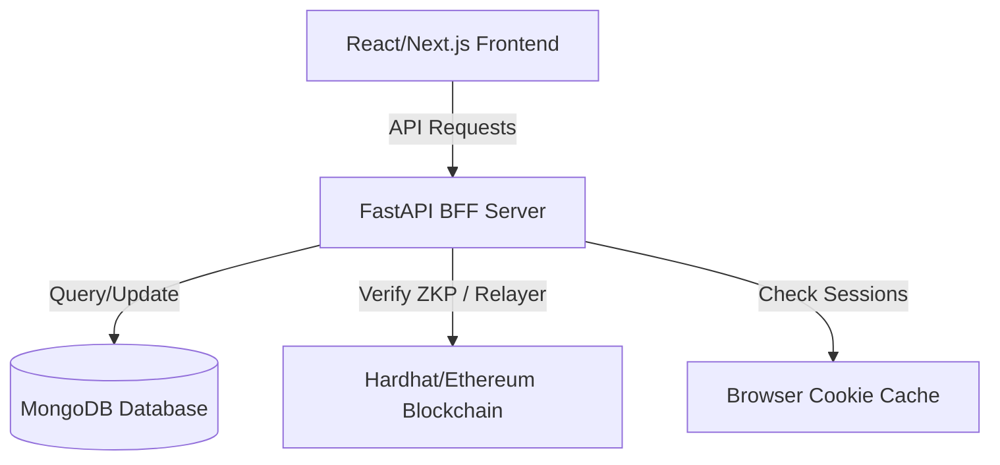

# Meta Go: Decentralized Identity (DID) & Trust Framework
## Comprehensive Product Report

This report provides a clear, non-technical overview of the Meta Go application, its core features, backend operations, and how it solves modern security and privacy challenges.

---

## 1. Executive Summary & Product Vision

### The Problem of the Modern Web
Today, logging into websites and verifying who we are is broken. We rely on traditional methods:
1. **Passwords**: We have to remember dozens of them. They are frequently stolen in database hacks.
2. **Centralized Social Logins (Google/Facebook)**: These companies track all the websites we visit and monetize our data.
3. **Identity Verification (KYC)**: To prove our age or country, we upload photos of our driver's licenses or passports to company databases. If those companies get hacked, our identity is stolen.
4. **AI Bots & Deepfakes**: The internet is being flooded with automated accounts and fake profiles. Traditional sign-ups cannot distinguish a real human from an AI script.

### The Meta Go Solution
**Meta Go** is a next-generation **Decentralized Identity (DID)** platform. It allows users to create a secure, private digital passport that they control entirely. 
- Instead of usernames and passwords, it uses **blockchain wallets**.
- Instead of uploading photos of passports, it uses **Zero-Knowledge Proofs (ZKPs)** to verify traits (like "I am a real human" or "I am over 18") without revealing the underlying personal information.
- Instead of centralized storage, it stores data locally on the user's device and logs cryptographic proofs on public blockchains using **Soulbound Tokens (SBTs)**—which are special, non-transferable digital badges.

---

## 2. Core App Features & Functions

Here is a detailed breakdown of the functions built into Meta Go:

### A. Sign-in With Ethereum (SIWE)
Instead of typing a email and password, the user logs in by signing a secure cryptographic message with their Web3 digital wallet (like MetaMask).
- **How it works**: The app generates a temporary, randomized token called a "nonce." The user signs this nonce with their wallet. The backend verifies the signature. 
- **Real-World Benefit**: Hackers cannot steal your password because there *is* no password. Even if our servers are hacked, your private keys never leave your digital wallet.

### B. High-Tech Biometric Scanner & Liveness Detection
To prevent bots from signing up, Meta Go uses a webcam-based biometric scan. It runs a neural network inside the user's browser using **TensorFlow.js FaceMesh**.
- **The Steps**: The scanner guides the user through four sequential alignment tasks:
  1. **Center Face**: Center the face in the camera frame.
  2. **Turn Left**: Turn the head to the left.
  3. **Turn Right**: Turn the head to the right.
  4. **Blink**: Blink eyes to authenticate.
- **Under the Hood**: The system measures real-time coordinates, calculating the Eye Aspect Ratio (EAR) for blinks and nose-to-eye horizontal distance ratios for head rotation. If a webcam is unavailable or blocked, the system switches to a secure, high-tech simulated scan sequence to let users preview the logic.
- **Privacy First**: The app **does not save your video or photos**. It only reads temporary landmark coordinates, hashes them locally, and discards the video feed instantly.

### C. Zero-Knowledge Proof (ZKP) Engine
Zero-Knowledge Proofs allow you to prove a statement is true without sharing any extra information.
- **How it works**: The app takes the biometric measurement hashes and the user's wallet secret, computes a witness, and runs a local mathematical ceremony using **snarkjs** (Groth16 proving algorithm).
- **Real-World Benefit**: The user gets a cryptographic token proving they are a unique human, which is recorded on the blockchain. When logging into other apps, they can prove their identity without ever exposing their real name or facial details.

### D. Soulbound Tokens (SBTs) & Cross-Chain Bridges
A Soulbound Token is a non-transferable token minted to a user's wallet. It cannot be sold, traded, or transferred to anyone else. It serves as your permanent digital badge.
- **Cross-Chain Synchronization**: Using Chainlink CCIP (Cross-Chain Interoperability Protocol), a user can mint their identity badge on one blockchain (e.g., Ethereum) and sync or "bridge" it to other networks (e.g., Arbitrum, Optimism, Base). This allows them to use their verified identity on different apps across the entire blockchain ecosystem.

### E. Social Account Recovery
Traditional wallets have a major flaw: if you lose your private key (seed phrase), you lose everything. Meta Go fixes this using a smart-contract-based **Social Recovery** system.
- **How it works**: During setup, you nominate a few trusted friends or alternative wallets as your "Guardians." If you lose access, your Guardians can sign a transaction confirming that you are the true owner. The smart contract then migrates your digital identity to a new wallet address.

---

## 3. Before-vs-After Comparison: How Meta Go Improves Lives

| Feature / Scenario | Before (Traditional Methods) | After (With Meta Go) | Benefits & Profits |
| :--- | :--- | :--- | :--- |
| **User Sign-Up & Login** | Users fill out long forms, verify email links, and create complex passwords. They forget passwords, requiring resets. | Users click "Sign In," authorize their digital wallet, and do a quick 3-second face alignment/blink check. | **Saves Time**: Sign-up takes less than 10 seconds. No passwords to remember or change. |
| **Identity Verification** | Uploading passport photos or ID cards. High risk of identity theft if the third-party verifier's database is hacked. | The local FaceMesh creates mathematical coordinates. A local ZK Proof is computed. No images are uploaded. | **Maximum Security**: Personal details are never stored. Zero chance of database identity leaks. |
| **Account Recovery** | Submitting support tickets, sending copy of IDs to administrators, and waiting days for manual verification. | The user contacts their 3 nominated Guardians. Guardians sign a contract transaction, and the identity shifts to a new wallet. | **User Control**: Fast, autonomous recovery within minutes without relying on a company's customer support. |
| **Logging into Third-Party Apps** | Creating new accounts on every single site. Companies track search and browsing behaviors via social log-ins. | Apps request a "Meta Go ID login." Meta Go sends a secure ZK proof. No user tracking is possible. | **Absolute Privacy**: Full control over what data is shared. Users own their web traffic history. |

---

## 4. Admin Panel & Backend Architecture

For administrators running Meta Go, the system is designed to be highly transparent and easy to maintain.

### The Admin Panel
The Admin Panel is a dedicated dashboard accessible at `/admin`. It provides:
1. **Network Statistics**: Total registered identities, number of SBTs minted on-chain, count of proofs verified, and system health status.
2. **Real-time Event Logging**: Shows recent network actions (e.g., when a user registers, when an SBT is minted, or when a cross-chain sync triggers).
3. **System Maintenance**: Allows admins to see which cryptographic keys are being used, audit rate limits, and monitor smart contract calls.

### Backend & Database Maintenance
The Meta Go backend is a **FastAPI** application (Python) connected to a **MongoDB** database.
- **FastAPI BFF (Backend-for-Frontend)**: Located in the `backend/` directory. It runs on port `8001` and serves endpoints for wallet authentication, ZK verification, recovery setups, and billing checkouts.
- **MongoDB**: Used to store user profiles (wallet addresses, handles, email options, and active subscription details).
- **How to view the data**:
  - Download and open **MongoDB Compass** (a free visual database program).
  - Connect to the database string: `mongodb://localhost:27017`.
  - Open the `test_database` database and look at the `users` collection. Here, admins can manually adjust user settings, active subscriptions, or clear test data.
- **Running the Backend Server**:
  - Run from the `backend` folder: `venv/Scripts/python -m uvicorn server:app --port 8001`

---

## 5. Subscription Plans & Commercial Growth

To monetize the service while remaining open and accessible, Meta Go utilizes a three-tiered subscription model:

1. **Free Plan ($0)**
   - **Features**: Basic identity registration, local FaceMesh biometric checks, up to 10 verifications per month.
   - **For**: Everyday web users who want to protect their login security.
2. **Developer Plan ($49/month)**
   - **Features**: 5,000 identity verifications/month, API access to integrate Meta Go logins into their own apps, custom OAuth/OIDC client setups.
   - **For**: Startups and web projects looking to filter out bots and use passwordless logins.
3. **Enterprise Plan (Custom Pricing)**
   - **Features**: Unlimited verifications, dedicated hosting, custom Service Level Agreements (SLAs), compliance audit packs (GDPR/SOC2).
   - **For**: Large corporations, financial institutions, and major gaming networks.

### Connection & Growth Mechanism
By offering developers simple OAuth/OIDC endpoints, they can replace their entire database authentication code with Meta Go. As more websites support "Sign-In with Meta Go," the app creates a viral growth loop:
1. **Websites** adopt Meta Go to block AI bots and reduce password database liability.
2. **Users** sign up to Meta Go because their favorite websites require a liveness verification badge.
3. **Network Effects** take hold: every new app that integrates Meta Go attracts more users, and every new user attracts more apps.

---

## 6. The Future: Why Meta Go Will Become Mandatory

In the next 3 to 5 years, decentralized identity will transition from a "nice-to-have" feature to an industry-wide mandate:
1. **The AI Bot Wave**: With LLMs capable of writing human-like comments and filling out forms, traditional captchas (clicking traffic lights) are useless. Platforms will require cryptographic liveness check tokens like Meta Go to guarantee you are interacting with a real human.
2. **Stricter Privacy Laws**: Governments are passing regulations (like GDPR in Europe and CCPA in California) that heavily fine companies that leak user passwords or personal details. Companies will willingly outsource authentication to decentralized services to avoid storing risky personal data.
3. **Sybil Attacks in Web3**: In decentralized finance and voting, malicious actors create thousands of fake wallets to manipulate outcomes. Meta Go's non-transferable Soulbound Tokens ensure "one person, one vote" on the blockchain.

By building on Meta Go now, we are positioning ourselves at the center of the next major shift in internet infrastructure.
